# サーバを作ろう！

本ページでは、AWS EC2 のインスタンスにWebサーバをインストールするところまでの手順を記載します。

公式のドキュメントがあるので、それを参考に作成しています。
[Amazon Linux インスタンスを作成する - AWS](https://aws.amazon.com/jp/premiumsupport/knowledge-center/create-linux-instance/)
[Amazon EC2 Linux インスタンス入門](https://docs.aws.amazon.com/AWSEC2/latest/UserGuide/EC2_GetStarted.html)


# 構築の流れ
- AWSコンソールにログインする
- EC2 インスタンスを作成する
- セキュリティグループを変更してHTTPでアクセスできるようにする
- 作成したインスタンスにSSHアクセスできるようにする
- インスタンスにWebサーバをインストールする

# AWSコンソールにログインする
まずは、AWSアカウントを作成してコンソールにログインしましょう

公式の手順が一番わかりやすいので、そちらを参照してください
[AWS アカウント作成の流れ](https://aws.amazon.com/jp/register-flow/)


# EC2 インスタンスを作成する

## リージョンを選択する

EC2インタンスを作成する前に、どこのリージョンにインタンスを作るのかを決めます。

リージョンは国単位に分かれており、これを選ぶことは「自分のAWSのデータを、どこの国のデータセンターに作成するのか」を選ぶことに相当します。

参考　[リージョンとゾーン - Amazon Elastic Compute Cloud](https://docs.aws.amazon.com/ja_jp/AWSEC2/latest/UserGuide/using-regions-availability-zones.html)

リージョンを選ぶ場合、「料金」と「利用できるサービス」と「通信速度」が選考のポイントになると思います。

料金と通信速度はAWSサービス毎に異なります。


使用したいAWSサービスを決めた上で、「料金」「利用できるサービス」「通信速度」の観点から最適なリージョンを選択しましょう。

参考　[AWS のリージョンの選び方](https://cloud-textbook.com/734/)

### リージョン選択方法

今回はテストで作成するので「料金」「利用できるサービス」「通信速度」はあまり気にする必要はありません

日本のデータセンターであるほうが通信速度が出るであろう、という理由でコンソール左上のプルダウンから「東京」リージョンを選択します。


## EC2画面に移動

インスタンス作成のため、EC2のダッシュボードに移動します。

コンソールの上にある検索欄に「EC2」と入れて検索すると、EC2サービスが表示されるのでそれを選択します。
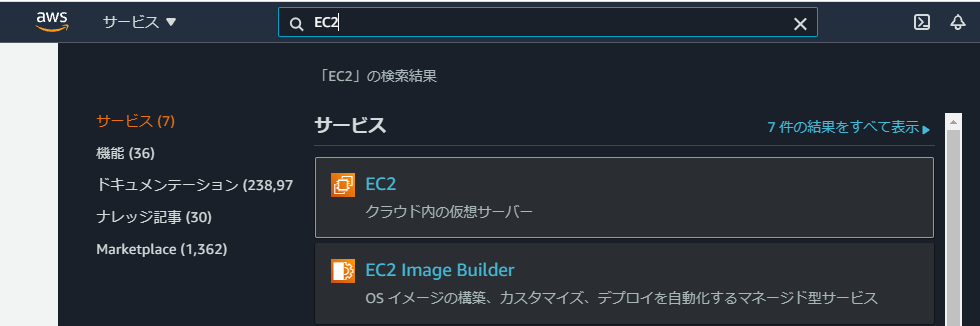


## インスタンス作成画面に移動

E2Cのダッシュボードに移動するので、「インスタンスを起動」を選択します。

遷移先の画面から、作成するインスタンスの設定を選択してゆきます。

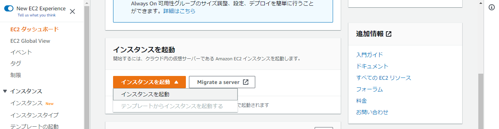


## OSを選択

作成するインスタンスのOSを選択します。
今回はAmazon Linux2を選びます。（無料なので）

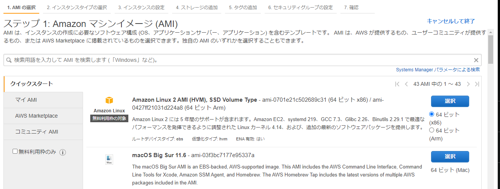


OSを選ぶ時に64ビット(x86)と64ビット(Arm)を選べますが
これによって後に選択できるインスタンス タイプが変わります。

今回はx86を選びます。


## インスタンスタイプを選択

インスタンスタイプはCPU性能とかメモリ容量とかディスク容量だとかのスペックの組み合わせにt2.microとかの名前を付けたものです。

参考 [Amazon EC2 インスタンスタイプ](https://aws.amazon.com/jp/ec2/instance-types/)

今回はt2.microを選びます。（無料なので）

「確認と作成」を選択して確認画面に遷移します。

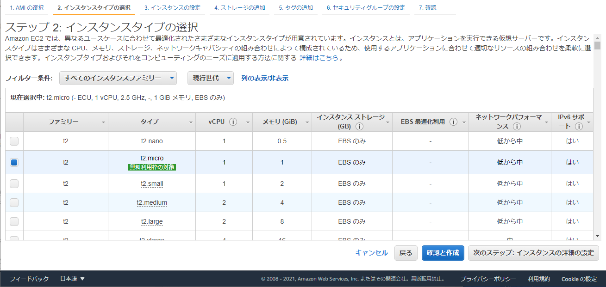


なお、「次のステップ：インスタンスの詳細の設定」を選択するとスペックの詳細設定が可能です。
デフォルトだとディスク容量が8Gなのですが、これを30Gまで増やせるので、そこだけ設定しても良いかもしれません


## 確認してインスタンスを作成

作成する内容を確認して「起動」を選択します。

デフォルト設定だとセキュリティグループの警告が表示されますが、後で設定するので一旦無視します。

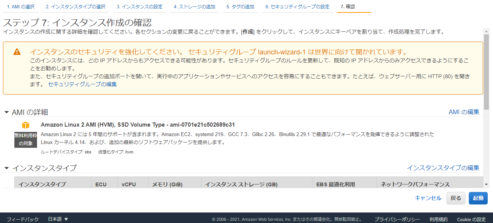


## キーペアの作成

キーペアは作成したインスタンスにSSH接続する際の鍵ファイルになります。

・「新しいキーペアを作成」を選択
・キーペアのタイプはRSA
・キーペア名は適当
にしてキーペアをダウンロードします。

ダウンロードしたら「インスタンスの作成」を選択します。
これでインスタンスの作成はできました。

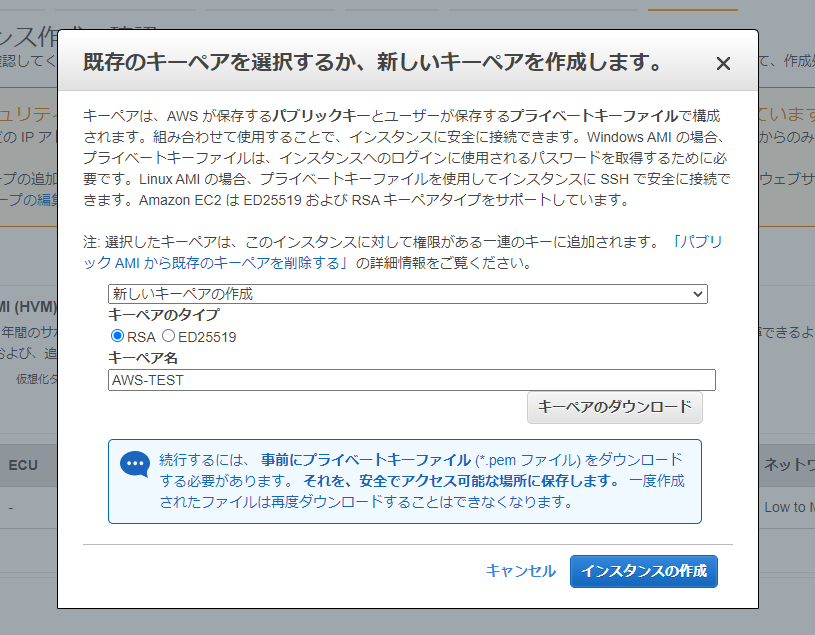


# セキュリティグループを変更してHTTPでインスタンスにアクセスできるようにする

セキュリティグループは、ファイアウォールのようなもので
特定の通信を許可したり禁止したりする設定のグループです。

デフォルトではSSH以外の通信はNGになっているようなので
Webサーバとして扱うにはHTTPの通信を許可してやる必要があります。


まずはセキュリティグループの編集画面に移動します。

左メニューの「セキュリティグループ」
↓
インスタンス作成時に作ったセキュリティグループ名を選択（launch-wizard-1）
↓
「Edit inbound rules」を選択

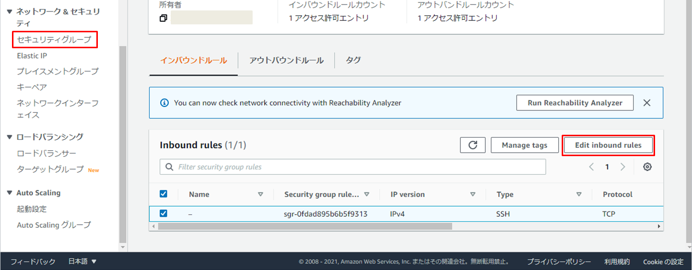


初期状態ではSSHの設定のみ存在します。
HTTPの設定を追加しましょう

・「ルールを追加」を押す
・追加された項目のタイプをHTTPに変更する
・追加された項目のソースをAnywhere-IPv4に変更する
・「ルールを保存」を押す

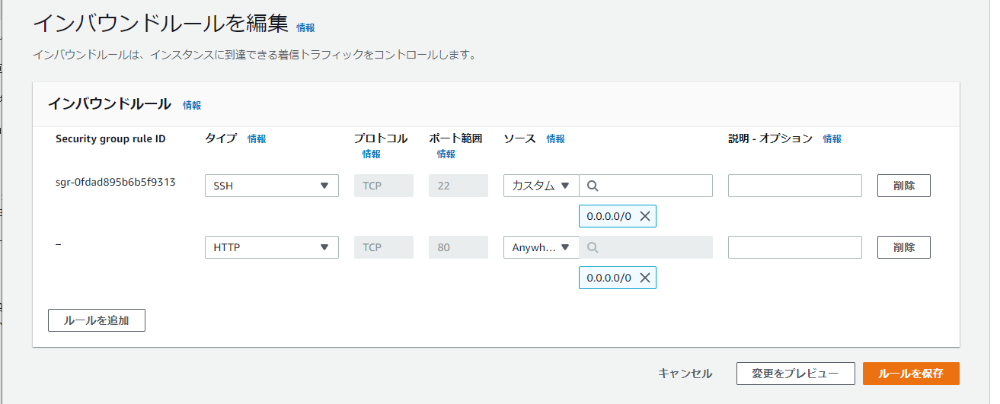


この時、ソースのところに「0.0.0.0/0」と表記されています。
これは「全てのIPアドレス」示す値なので、
このセキュリティグループは「SSHとHTTPの接続であれば、どのIPアドレスからでも受けれますよ」という設定になります。

特にSSHを全てのIPアドレスからアクセス許可してしまうのは危険なので、なるべく自分のIPからしかアクセスを受け付けないよう制御をかけましょう

自身のIPアドレスを調べるのはwebサービスを使うのが簡単です
[IPアドレス確認サイト](https://www.cman.jp/network/support/go_access.cgi)

IPアドレスが分かったら、ソースを「カスタム」にして、調べたアドレスを入力しましょう。

もしくは、ソースに「マイIP」を選択すれば、自動で自分のIPを設定してくれます。


# 作成したインスタンスにSSHアクセスできるようにする

インスタンスのシェルへアクセスする方法は複数ありますが、今回はSession Managerを使って作成したインスタンスにアクセスしましょう。

Session ManagerはAWS Systems Manager 機能の１つです。
この機能を使ってインスタンスにSSHアクセスすることができます。

AWS Systems Manager というシステムを踏み台サーバにして、EC2インスタンスにSSH接続するイメージです。

Session Managerを使ってアクセスすることで
 ・ログが取れる
 ・ログインするユーザの権限を細かく制限できる
 などのメリットを受けることができます。

 参考　[セッションマネージャー越しにSSHアクセスすると何が嬉しいのか](https://dev.classmethod.jp/articles/ssh-through-session-manager/)


## IAMロールの作成

まずはIAM ロールを作成します。
ここで作るロールは、インスタンスが AWS Systems Manager の機能を使用できるようにするものです。


### 手順1
・AWSサービスから「IAM」を選択
・左メニューから「ロール」を選択
・「ロール作成」ボタンを選択

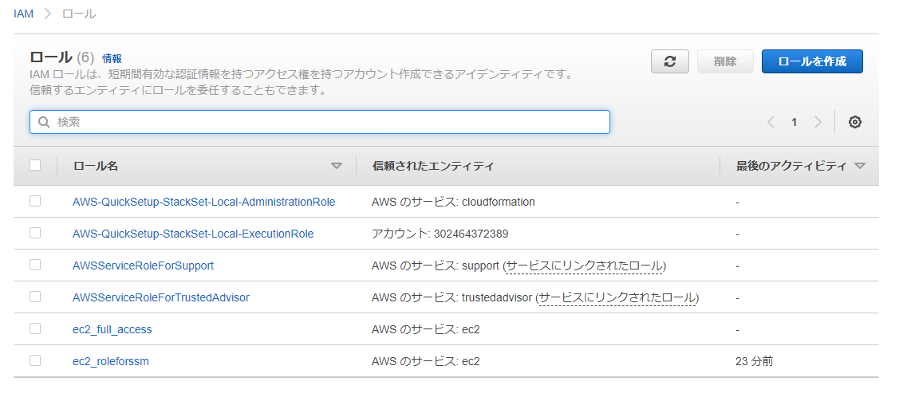

### 手順2
・エンティティの種類に「AWSサービス」を選択

・ユースケースに「EC2」を選択し次の画面に遷移
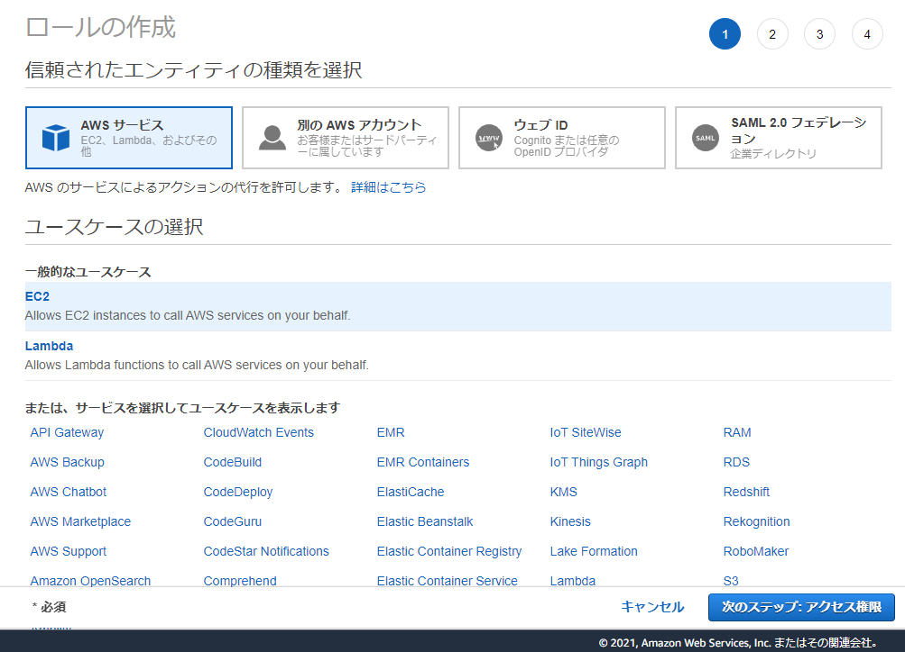


### 手順3

・ポリシーの検索窓にAmazonSSMManagedInstanceCore を入力
・表示された権限にチェックして次の画面に遷移
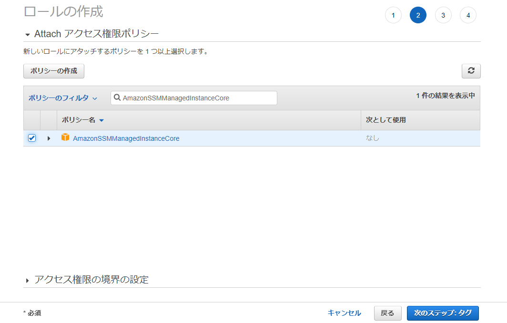


### 手順4

・画面に従いタグを付けて次の画面に遷移（必須ではない）
・画面に従いロール名を付けてロールを作成（任意の名前でOK)


## EC2インスタンスにIAMロールをアタッチする
先程作ったIAMロールをEC2インスタンスにアタッチします。
これにより、アタッチしたインスタンスが AWS Systems Manager の機能（Session Manager等)を使えるようになります。

### 手順1
・作成したインスタンスの詳細画面を開く
・「インスタンスの状態」＞「セキュリティ」＞「IAMロールを変更」を選択
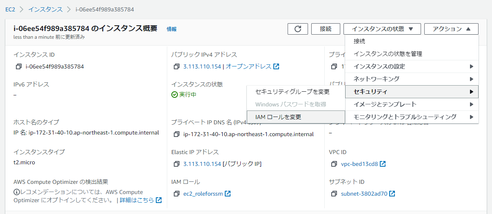

### 手順2
・先程作ったIAMロールを選択して保存
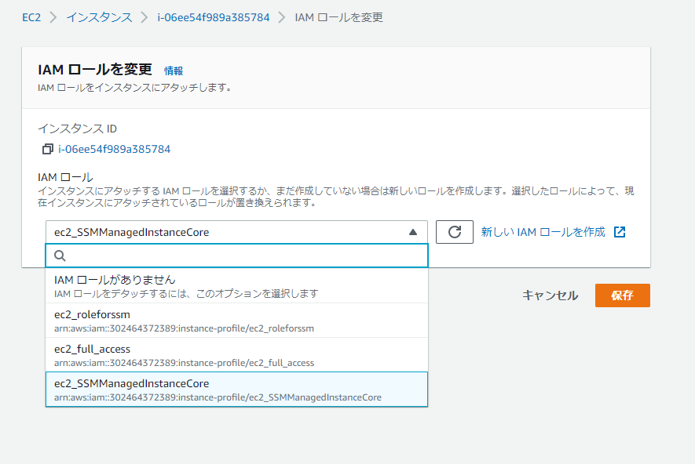


##　インスタンスのシェルにアクセスする
これでSession Managerを使う準備が整ったので、早速アクセスしてみます。

### 手順1
・AWSサービスから「AWS Systems Manager」を選択
・左メニューから「セッションマネージャー」を選択
・「セッションの開始」ボタンを選択
・アクセスできるインスタンスが表示されるので、選択して「セッションを開始する」を選択
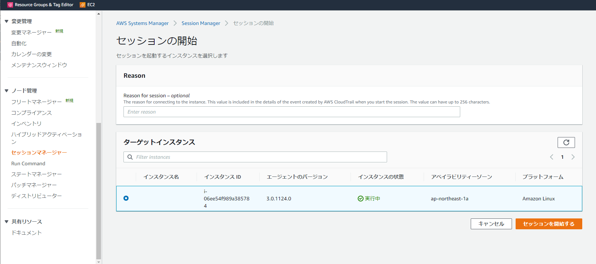


以下のような画面になっていたら成功です。
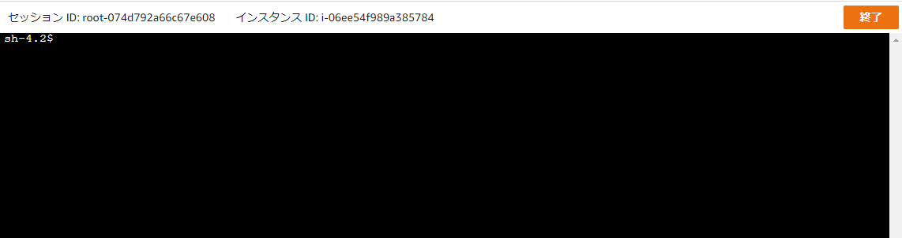


# インスタンスにWebサーバをインストールする

インスタンスに接続できたら今度はWebサーバ（nginx）をインストールします。


以下コマンドをシェル上で実行し、nginxをインストールして下さい


```
sudo amazon-linux-extras install nginx1
```


ここで使っているamazon-linux-extrasというコマンドはAmazon Linux2用のyumコマンドのようなもので
Amazon Linux2がサポートしている最新verの各種パッケージがインストールできるようです。

■Amazon Linux Extras
https://aws.amazon.com/amazon-linux-2/faqs/#Amazon_Linux_Extras


インストールできたらnginxを起動します。

```
# nginx起動
$ sudo systemctl start nginx

# 起動できたか確認
$ systemctl status nginx
```

## ブラウザからアクセスする
webサーバがちゃんと立ち上げられたのか確かめるため、ブラウザからアクセスしてみましょう


ブラウザに入力するURLは以下です。

<a>http://{インスタンスのパブリックIPv4アドレス}</a>

例：　http://ec2-13-112-23-166.ap-northeast-1.compute.amazonaws.com

パブリックIPv4アドレスは、以下のインスタンス概要画面で確認できます。

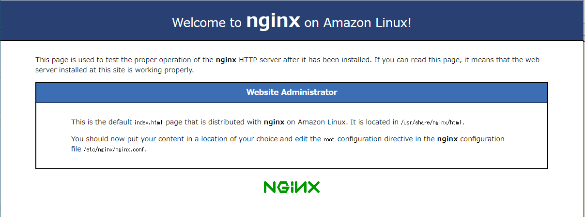


無事にWebサーバが稼働していれば、以下画面が表示されます。

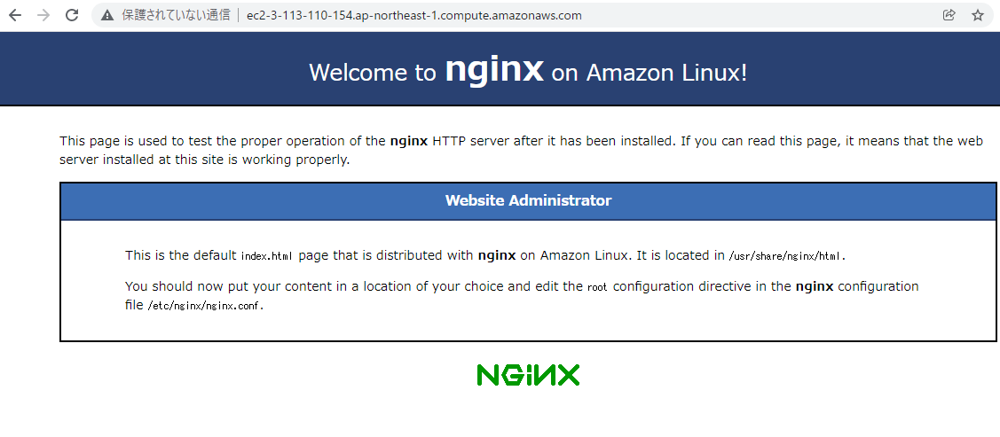

もし、表示されなければセキュリティグループの設定を見直して
・HTTPが許可されていること
・自分のIPアドレスが許可されていること
を確認してみてください