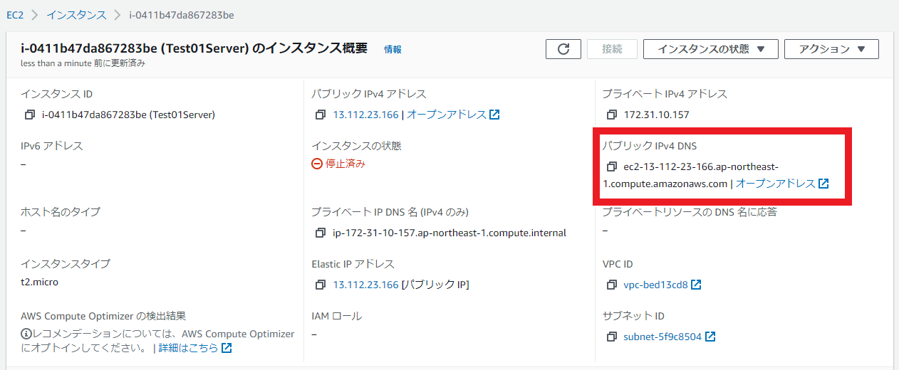

# サーバを作ろう！

本ページでは、AWS EC2 でインスタンスを立てて、nginxをインストールするところまでの手順を記載します。

公式のドキュメントがあるので、それを参考に作成しています。
<a href="https://aws.amazon.com/jp/premiumsupport/knowledge-center/create-linux-instance/" target="_blank">Amazon Linux インスタンスを作成する - AWS</a>
<a href="https://docs.aws.amazon.com/AWSEC2/latest/UserGuide/EC2_GetStarted.html" target="_blank">Amazon EC2 Linux インスタンス入門</a>


# 構築の流れ
- AWSコンソールにログインする
- EC2 インスタンスを作成する
- セキュリティグループを変更してHTTPでアクセスできるようにする
- SSHアクセスできるようにする
- nginxをインストールする

# AWSコンソールにログインする
AWSアカウントを作成してコンソールにログインする

公式の手順が一番わかりやすいので、そちらを参照
<a href="https://aws.amazon.com/jp/register-flow/" target="_blank">AWS アカウント作成の流れ</a>


# EC2 インスタンスを作成する


## EC2画面に移動

コンソールの上にある検索欄に「EC2」と入れて検索し、表示されたらそれを選択します。


## インスタンス作成画面に移動

E2Cのダッシュボードに移動するので、「インスタンスを起動」を選択します。


## OSを選択

作成するインスタンスのOSを選択します。
今回はAmazon Linux2を選びます。無料なので


OSを選ぶ時に64ビット(x86)と64ビット(Arm)を選べます
これによって後に選択できるインスタンス タイプが変わります。

無料枠で利用する場合はx86を選びます。


## インスタンスタイプを選択

インスタンスタイプはCPU性能とかメモリ容量とかディスク容量だとかのスペックの組み合わせにt2.microとかの名前を付けたものです。
<a href="https://aws.amazon.com/jp/ec2/instance-types/" target="_blank">Amazon EC2 インスタンスタイプ</a>

今回はt2.microを選びます。無料なので

「確認と作成」を選択して確認画面に遷移します。


なお、「次のステップ：インスタンスの詳細の設定」を選択するとスペックの詳細設定が可能です。
デフォルトだとディスク容量が8Gなのですが、これを30Gまで増やせるので、そこだけ設定しても良いかもしれません


## 確認してインスタンスを作成

作成する内容を確認して「起動」を選択します。

デフォルト設定だとセキュリティグループの警告が表示されますが、後で設定するので一旦無視します。


## キーペアの作成

キーペアは作成したインスタンスにSSH接続する際の鍵ファイルになります。

・「新しいキーペアを作成」を選択
・キーペアのタイプはRSA
・キーペア名は適当
にしてキーペアをダウンロードします。

ダウンロードしたら「インスタンスの作成」を選択します。
これでインスタンスの作成はできました。


# セキュリティグループを変更してHTTPでインスタンスにアクセスできるようにする

セキュリティグループは、ファイアウォールのようなもので
特定の通信を許可したり禁止したりする設定のグループです。

デフォルトではSSH以外の通信はNGになっているようなので
HTTPの通信を許可してやる必要があります。

まずはセキュリティグループの編集画面に移動します。

左メニューの「セキュリティグループ」
↓
インスタンス作成時に作ったセキュリティグループ名を選択（launch-wizard-1）
↓
「Edit inbound rules」を選択


初期状態ではSSHの設定のみ存在します。
HTTPの設定を追加しましょう

・「ルールを追加」を押す
・追加された項目のタイプをHTTPに変更する
・追加された項目のソースをAnywhere-IPv4に変更する
・「ルールを保存」を押す


この時、ソースのところに「0.0.0.0/0」と表記されています。
これは「全てのIPアドレス」示す値なので、
このセキュリティグループは「SSHとHTTPの接続であれば、どのIPアドレスからでも受けれますよ」という設定になります。

特にSSHを全てのIPアドレスからアクセス許可してしまうのは危険なので
なるべく自分のIPからしかアクセスを受け付けないよう制御をかけましょう


# SSHでアクセスする

作成したインスタンスにSSHでアクセスします。
自分のSSHクライアントで以下を実行します。

```
$ ssh -i "キーペア.pem" ec2-user@"インスタンスのIPアドレス"
```

・キーペア.pemはインスタンス作成時にダウンロードしたキーペアを指定してください
・ユーザ名はデフォルトのec2-userになります。
・インスタンスのIPアドレスは作成したインスタンスの詳細ページにある「パブリックIP4アドレス」がそれに当たります。


もしアクセスできない場合はセキュリティグループでSSHと自身のIPアドレスが許可されているか確認してみてください


# nginxをインストールする

SSH接続できたらnginxをインストールします。

amazon-linux-extrasというコマンドはAmazon Linux2用のyumコマンドのようなもので
Amazon Linux2がサポートしている最新verの各種パッケージがインストールできるようです。

■Amazon Linux Extras
https://aws.amazon.com/amazon-linux-2/faqs/#Amazon_Linux_Extras


```
sudo amazon-linux-extras install nginx1
```

インストールできたらnginxを起動します。

```
$ sudo systemctl start nginx

# 起動できたか確認
$ systemctl status nginx
```

これで設定は終わりです。
ブラウザからhttpで作成したインスタンスにアクセスすれば、以下画面が表示されます。
もし、表示されなければセキュリティグループの設定を見直して
・HTTPが許可されていること
・自分のIPアドレスが許可されていること
を確認してみてください




# その他

### インスタンスを作るリージョン
EC2インスタンスをリージョンによって料金や利用できるサービスが異なります。

試しに作るならどのリージョンでも良いと思いますが
ちゃんとしたサービスを作る場合は要チェックです。

以下は、リージョンの選び方と料金に関する参考記事

・AWSの料金
https://www.bit-drive.ne.jp/managed-cloud/column/column_33.html

・AWS のリージョンの選び方
https://cloud-textbook.com/734/


#### リージョンとは
詳細は公式ドキュメントを参照
<a href="https://docs.aws.amazon.com/ja_jp/AWSEC2/latest/UserGuide/using-regions-availability-zones.html" target="_blank">リージョンとゾーン - Amazon Elastic Compute Cloud</a>


自分の理解は「自分のEC2インスタンスのデータが配置される国」

イメージは
・AWSは各国に巨大なパソコンを配置している
・AWSは巨大パソコン毎にデータを管理している
・ユーザが何らかのAWSサービス(EC2など)を利用すると、その巨大パソコンのどれかにデータが作られる
・巨大パソコンはリージョンと呼ばれている

そして重要なのは、**後からリージョンを変えるのは大変**なので商用で利用する場合は慎重に選ぶ必要があること

#### リージョンの選び方
リージョンによって
料金、対応サービス、通信速度が異なるので、どれを重視するかでリージョンを決める

**料金**
EC2は主に、「インスタンスの起動時間」「ストレージ使用量」「通信量」の従量課金になっている。
金額はリージョンによって異なり、例えば「インスタンスの起動時間」だと以下のように東京リージョンの方が高い

|         リージョン         | インスタンスタイプ |      料金      |
| :------------------------: | :----------------: | :------------: |
| アジアパシフィック（東京） |      t2.micro      | 0.0152USD/時間 |
| 米国東部（バージニア北部） |      t2.micro      | 0.0116USD/時間 |

ほかに、「通信量」などを見ても東京リージョンは米国リージョンより高い料金で設定されている場合が多い

リージョン毎の料金については下記の公式資料を参照
https://aws.amazon.com/jp/ec2/pricing/on-demand/