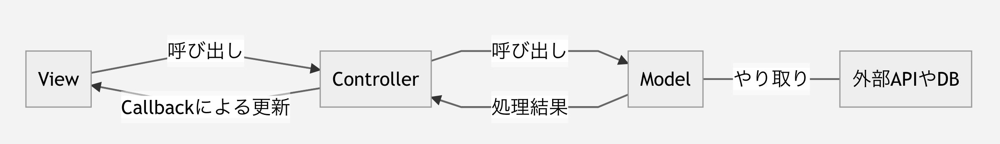
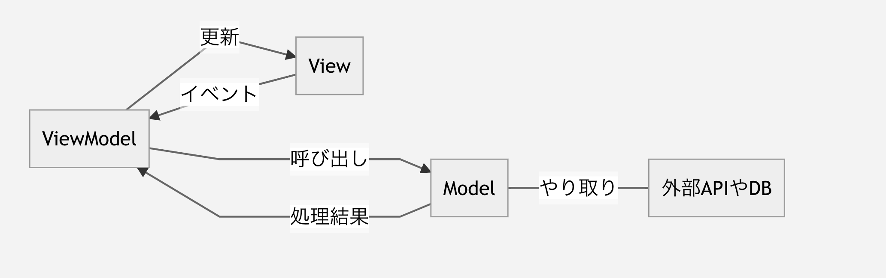
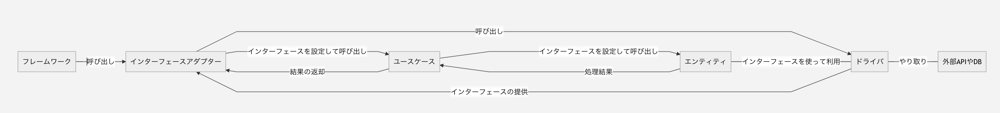

# アーキテクチャをできるだけ簡単にとらえて活用してみよう
ソフトウェアでのアーキテクチャは、プログラムをどう構造化するか、を整理するためのものです。
構造を整理して、実装を早く/安全に（バグを出さずに）改善できるモノを作ろう、という考え方をします。

# アーキテクチャをどう実現しよう？
実際にアーキテクチャ設計を実現するには、下記2つのステップを踏みます。

1. アーキテクチャの構成要素(コンポーネント）ごとにディレクトリを作成する
    - アーキテクチャの構成要素(コンポーネント）は機能の実装（プログラム）をまとめたものになります。
    - プログラムは実際にはファイルやパッケージディレクトリになるので、コンポーネントはディレクトリで表現することができます。
2. 依存関係を整理する
    - 一般的なアーキテクチャパターンはコンポーネント間の連携方法も合わせて設定されています。
        - コンポーネント間の依存関係を設定していきます。
            - 依存するとは、ライブラリとして読み込むこととほぼ同義です。コールバックなどを利用して依存性のやじるしを逆転させることもできます。
            - 具体的には、MVCの場合、controllerがViewとModelを読み込み、ViewはModelとcontroller読み込み、Modelは独立（内部のコンポーネントを読み込まない）です

### よくあるアーキテクチャ構造をまとめよう
#### MVC
Model/View/Contolerを構成要素に持つアーキテクチャです。
歴史が非常に古く、ほとんどの人が名前は聞いたことがある、と思います。
歴史が長くそこそこシンプルな構成であることから、様々な流派・拡張が存在します。
MVVMもMVCの拡張の一つと言えます。

- View
    - ユーザーに表示する画面、オブジェクトの管理を担当します。
    - eventもViewで設定を行い、controllerを呼び出します。
        - controllerのCallbackにViewの更新関数を設定することでModelの変更後にViewの更新が動作するようにします。
- controller
    - ViewとModelのつなぎこみを担当します
    - Viewからの入力をModelに渡し、Modelからの結果を元にViewを更新します。
- Model
    - アプリケーションが利用するデータや手続きを記述します。
    - データベースとのやり取りや外部のAPIとのやり取りもModelが担当します。

現代ではViewはJSやフレームワークの機能で提供されていることがほとんどで、実装はcontrollerとModelに集中します。
また、controllerに実装が集中しすぎるという課題があります。

#### MVVM
Model/View/ViewModelを構成要素に持つアーキテクチャです。

MVCの拡張で、Viewの情報を減らし、ViewModelの役割を明確化

- View
    - ユーザーに表示する画面、オブジェクトの管理を担当します。
    - 通常テンプレートのみを提供します
- ViewModel
    - ビューの管理とイベント処理を担当します
        - 各種Viewからのイベント処理。Viewとeventに対応したViewModel関数を用意することになります
        - Viewの更新
        - Modelの呼び出し
- Model
    - アプリケーションが利用するデータや手続きを記述します。
    - データベースとのやり取りや外部のAPIとのやり取りもModelが担当します。

フレームワークなどの機能でVMでデータを更新するとViewが更新される、というデータバインディングという仕組みが用意されています。

#### クリーンアーキテクチャ
クリーンアーキテクチャはフレームワークやDB等のインフラの依存を取り除くために提唱されたアーキテクチャです。
コンポーネントがMVCに比べて増えているのでMVCのどこに当たるのか、を併せて解説していきます。
また、フレームワークとインターフェースアダプター等、結合されることの多い構成もあります。

- フレームワーク
    - Viewに当たる部分です。
    - Webフレームワークやフロントフレームワーク等のエントリーポイント部分。
    - インターフェースアダプターを呼び出します。もしくはインターフェースアダプターと結合して書きます
- インターフェースアダプター
    - View/ViewModelに当たる部分です。
    - フレームワークから呼び出され、ドライバのインターフェースをユースケースと関連付けます。
        - ドライバを読み込み、引数としてユースケースを呼び出します。
    - 外部に提供するデータへの変換を担当します。
    - このときにドライバのインターフェースをユースケース関数にわたすことでユースケースやエンティティからドライバを呼び出せるようにします。
- ユースケース
    - controllerやViewModelに当たる部分です。
    - インターフェースアダプターから呼び出され、エンティティにドライバを渡してコールします。
    - シーケンスを記述します。ifやforが一番登場するブロックです。
    - 実処理自体はドライバのインターフェースを実行するか、エンティティを呼び出します。
- エンティティ
    - Modelのうち、どのようなインフラを利用しても変わらない処理を記述します
    - Modelと同様、常に独立しています。
    - ドライバをモック関数にして渡すことで単独でテスト可能になります。
    - 実処理を記述します。データの計算や文字列変換等を行います。
    - データの保存処理が必要な場合は、ドライバのインターフェースを実行します。
- ドライバ
    - ModelからデータベースやAPIとの接続など、プログラム外部と接続する部分のロジックを記述します。
    - 独立しています。依存性の注入を利用して、エンティティからコールされます。
    - 外部と接続するためのツール類です。
    - SQLクエリやリクエストパラメータのエンコードなどはここに記述します。

# 補足
## 依存性の注入
- コールバック
    - 呼び出した処理の終了時や指定したイベントの発生時に、引数として渡した関数をコールする仕組みです。
    - クロージャやパラメータの束縛などを利用することで、controllerの処理がおわったらViewを更新させる仕組みを、controllerに処理を書くことなく実現できます。
- 依存性の注入
    - SQLの発行やAPIの呼び出し等のインターフェースを外部から設定や引数として提供し、依存関係を排除しよう、という仕組みです。
    - 関数のポインタやインターフェースなどを引数に設定し、コールした関数内で引数に指定した関数を呼び出すことで実現できます。
    - こいつを利用すると、データベースに依存するロジックをデータベースを使わずにユニットテストできる状態にできます
        - 一番のメリットはここだと思う。
    - コールバックは依存性の注入の一種です
