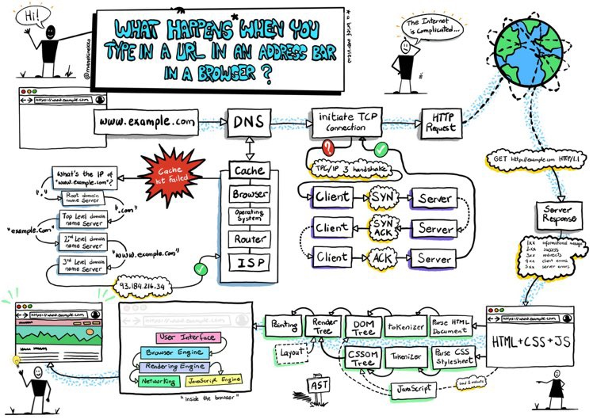

# ブラウザでWebページが表示されるまでを追いかけてみよう

上記はブラウザがWebページを表示するまでに行われていることをまとめた図です。 
このブロックでは、上の画像でやってることをなんとなく説明できるようになることを目標としています。 

# 1. [ブラウザのアドレスバーにURLを入れる](web_browse/1.md)
- リンクをクリックしたときや、googleで検索を行ったとき、ブラウザのアドレスバーにURLが入力されます。
- ブラウザはURLが入力されると、URLで指定されたサーバにアクセスし、情報を取得しようとします。
- 細かいことは補足を読むんだ。

まずは、入力されたURLを読み解いて、どういう方法で（=スキーム）、どこに接続して(=host)、何を要求するか（=url-path)を決定します

# 2. [URLををもとに接続したい相手を探す](web_browse/2.md)
- URLを解読した結果のホスト名から接続先を探します。
- DNSにこのホスト名のIPアドレスを教えてください、と問い合わせするとDNSがIPアドレスを教えてくれます。

接続先のhost(=ドメイン)がどこにあるのか(IPアドレス)をDNSに問い合わせ、接続先のIPアドレスを取得します

# 3. [クライアントとサーバの接続を確立する](web_browse/3.md)
- 取得したIPアドレスに対して接続を試みるよ！

接続先のhost(=ドメイン)がどこにあるのか(IPアドレス)をDNSに問い合わせ、接続先のIPアドレスを取得します

# 4. [クライアントの要求をサーバに伝える](web_browse/4.md)
# 5. [サーバが応答を返却する](web_browse/5.md)
# 6. [受け取った応答をブラウザが解釈する](web_browse/6.md)
# 7. [HTMLを読み込む](web_browse/7.md)
# 8. [CSSを適用する](web_browse/8.md)
# 9. [JSの処理を実施する](web_browse/9.md)
# 10. [画面が表示される！](web_browse/10.md)
