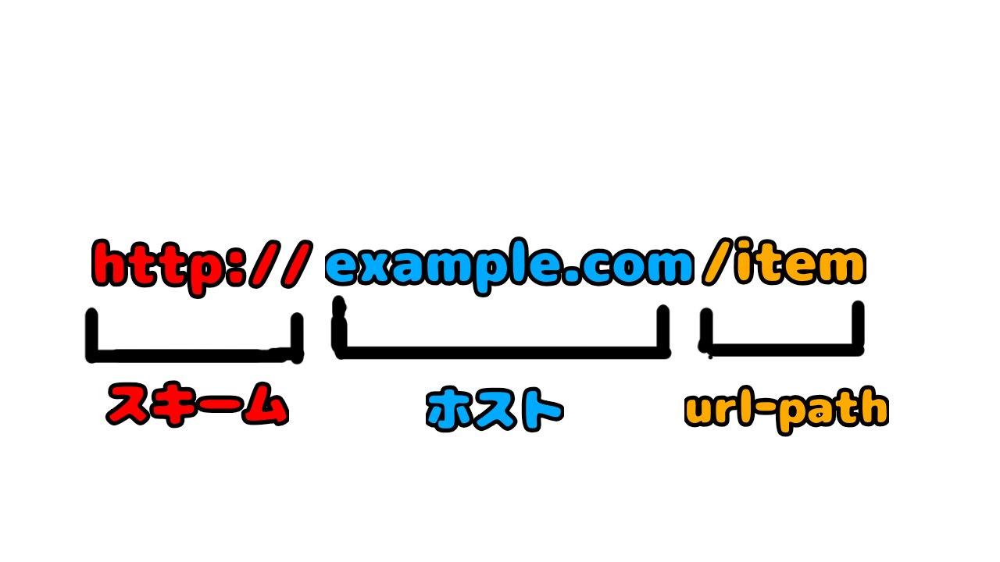

# 1. ブラウザのアドレスバーにURLを入れる
- リンクをクリックしたときや、googleで検索を行ったとき、ブラウザのアドレスバーにURLが入力されます。
- ブラウザはURLが入力されると、URLで指定されたサーバにアクセスし、情報を取得しようとします。
- 細かいことは補足を読むんだ。

まずは、入力されたURLを読み解いて、どういう方法で（=スキーム）、どこに接続して(=host)、何を要求するか（=url-path)を決定します



### 次のステップ
- 入力されたURLを読み解いたら、次は接続先を探す。<br>
[2. URLををもとに接続したい相手を探す](2.md)

--- 
# 補足；URLについて
## URLって何？
- Uniform Resource Locatorの略
- インターネット上のリソースを一意に特定するための文字列のこと。
    - 実はメールアドレスもURLの一種。詳細はフォーマットの話を読んでみてください

## URLのフォーマット
（スキーム名）:（スキームごとに定められた何かの表現形式）
- スキームは、http,https,mailto,ftpなどプロトコルやツールを示す。
- スキーム毎に形式は違う。mailtoの場合、スキーム毎に定められた形式はメールアドレスの形式になる

### IP接続を伴うスキームの表現形式
```
//<user>:<password>@<host>:<port>/<url-path>
```
- 不要なパラメータは省略。httpsのURLの場合、user,password,portはほぼ確実に省略される
    - portは一般的に443が使われるため通常指定されない
    - user/passwordもwebページ表示だけでは利用されにくい

#### 例：httpsのURL構成
```
https://www.example.com/
```
- httpsがスキーム
- www.example.comがホストを示している

## URLの構成要素詳細

### スキーム
- httpやhttpsなどプロトコルを示す。
- webでは上記2つが認識できていればひとまず良い。
    - 最近ではhttpはブラウザに保護されない通信のような警告がでるようになった
    - httpsはTLSというセキュリティプロトコルでhttp通信をやるためのスキーム。

### user/password
- ftpなどの認証を伴うスキームで使われるユーザーとパスワードの情報
- webブラウザ使うときはほとんど使わない。
- basic認証が設定されているならここにUser/Password入れると突破できる
- git接続するときにUser指定するときとかには使うかも。

### host
- ホスト名、IPアドレス等接続先を特定できる名称を指定する

### port
- 接続先port番号を示す。
- ホストの中でアプリケーションに通信を振り分けるための番号。
- 指定がなければスキーム毎に決められたportを利用する

### url-path
- ホスト配下のリソースを指定するパス。Webページだとディレクトリ構成と同義だったりする。
   - ページ内のボタンやリンクで提供されることがほとんどなので詳細をサービス利用者が意識することは少ない。

# 検索用関連キーワード
URL、host、port、ドメイン、スキーム、http、https

# 参考リンク
この手の純粋な定義を持つ用語はウィキペディアでしっかりまとまっているので、困ったら見てみましょう。
https://ja.wikipedia.org/wiki/Uniform_Resource_Locator


[次へ](2.md)