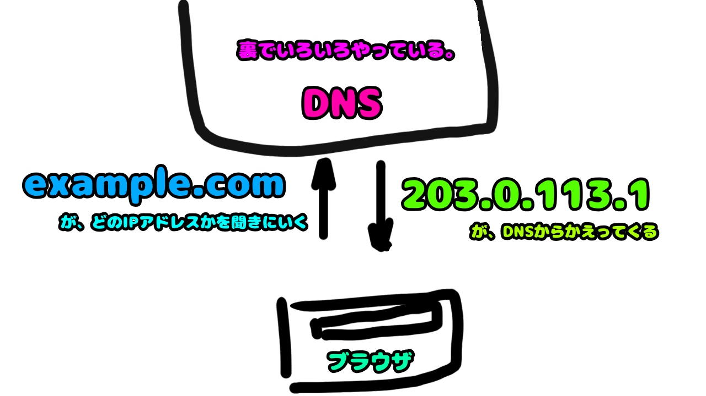

# 2. URLををもとに接続したい相手を探す

- URLを解読した結果のホスト名から接続先を探します。
- DNSにこのホスト名のIPアドレスを教えてください、と問い合わせするとDNSがIPアドレスを教えてくれます。
- 細かいことは補足を読むんだ。

接続先のhost(=ドメイン)がどこにあるのか(IPアドレス)をDNSに問い合わせ、接続先のIPアドレスを取得します

### 次のステップ
- 調べた接続先に対して通信をしていく。 
[3. クライアントとサーバの接続を確立する](3.md)

--- 
# 補足: ドメインとDNS
## ドメイン
ドメイン（domain）は
インターネットの世界においては、コンピュータやネットワークを識別したりするときに用いられる”名前”です。

ドメインはxxx.co.jpやxxx.comなどのように.区切りのアルファベットで構成されており、.com/.jp など末尾をみることでそのドメインがどのようなものかを判別することができます

- .jp: 日本のドメイン。日本在住の企業、人しか取得できない。
- .com: 商業者向けのドメイン
⇒ 末尾のドメインのことをトップレベルドメインと呼びます。
  また、日本の企業を示す.co.jpや日本の学校を示す.ac.jp などのように、さらにグループ分けされることもあります。

ドメイン名はユニークである必要があるため、ICANNという団体が一元管理しています。
また、ICANNから認証を受けた団体が管理・販売をしています。

インターネットを介してサービスを提供する場合、ドメイン名を獲得する必要があります。

## whois
ドメイン名やIPアドレスが誰のモノかを調べるための情報です。
macなどにもコマンドは入っているはずなので、試しに whois "会社のドメイン"とかしてみましょう。
ドメインにまつわる色んな情報が出てきます。

## DNS
ドメインは人間が覚えやすくするための”名前”です。
実際にネットワーク通信を行っているコンピュータはIPアドレスを持っていて、IPアドレスを利用して通信を行います。

ドメインとIPアドレスを交換してくれるシステムをDNS(Domain Name System)と呼びます。
コンピュータはホストにアクセスするにあたって、ドメイン名をDNSに問い合わせ、IPアドレスをもらいます。

ドメイン名を獲得してDNSにドメイン名とIPアドレスのセットを登録することで、サーバへアクセスできるようになります。

### DNSレコード
DNSに格納されている情報を「レコード」（DNSレコード、リソースレコード）と呼びます。
レコードにはいくつか種類があり、それぞれで格納されている情報が違います。

- Aレコード,AAAAレコード
    - ホスト名に対するIPアドレスの情報を意味するレコードタイプ
    - 正引きとよんだりする。
    - AとAAAAの違いはIPv4かIPv6
- PTRレコード
    - IPアドレスに対するホスト名を表すレコードタイプ
    - 逆引きとよんだりする
- MXレコード
    - 対象ドメイン宛のメール配送先ホスト名を定義するレコードタイプ。 
- CNAMEレコード
    - ドメインやホスト名の別名を定義するレコードタイプ
    - 複数のドメインを一つのIPに紐付けるときとかによく使う
    - 負荷分散関連の機能のために設定することもある
- TXTレコード
    - ホストのテキスト情報を記載
    - ドメインの所有権確認等に利用することがある（サービスから提示された情報をtxtに入れることで認証するとか）

その他、色々。種類や使い道が多いので必要に応じてしらべてみてください

### DNSキャッシュ
# 検索用関連キーワード
DNS、ドメイン
# 参考リンク
https://ja.wikipedia.org/wiki/%E3%83%89%E3%83%A1%E3%82%A4%E3%83%B3%E5%90%8D

[前へ](1.md) [次へ](2.md)