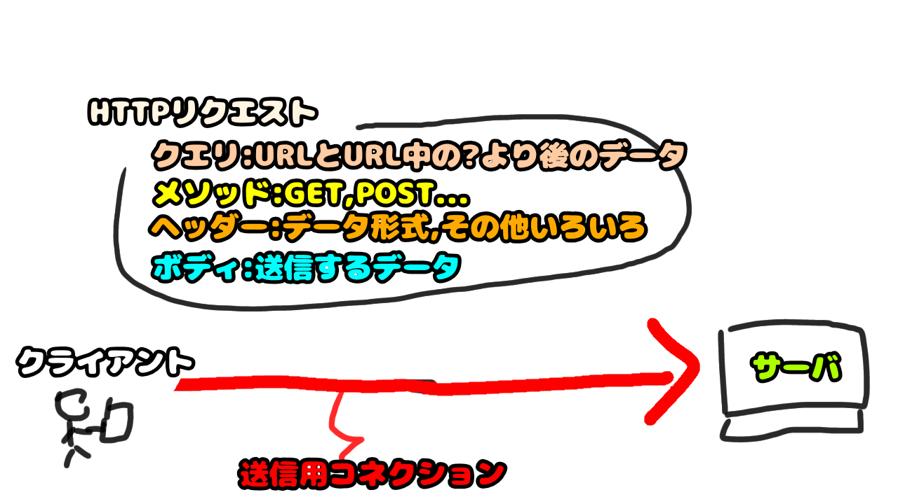

# 4. [クライアントの要求をサーバに伝える](4.md)
- 接続した経路を利用してクライアントの要求をサーバに伝えます。
- http、httpsだとGETやPOSTなどのメソッドがあるよ！
- ブラウザにURL入れたときに動くメソッドはGETです。

TCPコネクションを利用して、Webページの取得要求をサーバに伝えます

# 補足: HTTPリクエスト、ヘッダー、クエリとbody
## HTTPリクエスト
HTTPリクエストはテキストで構成されたメッセージです。
下記3つの要素で構成されています。
- リクエスト行（メソッドとURL）
- ヘッダー
- body

## リクエスト行
HTTPリクエストの1行目に置かれる対象のリソースとリソースに対する要求が記述されています。
### メソッド
リソースに対する要求の内容です。
主に使われるのは下記のGETとPOSTです。
- GET
    - データ取得を要求するメソッドです。
    - ブラウザで利用されるのはほとんどコレ。
    - 下記のbodyを利用せず、パラメータを設定したい場合はパスパラメータかクエリを利用します
- POST
    - クライアントからのデータ送信を行うメソッドです
    - ユーザーからのデータ入力に利用します。
    - 通常Bodyによるデータの送信を行い、URLにパラメータが反映されません。
- その他色々（DELETE,PUT...)

他にも色々なメソッドはありますが、API等でサポートされていない限りは意識して利用することはありません。
CORS対応で利用されるOPTIONSメソッドのようにサーバーで設定したらブラウザが自動で処理するものも存在します

### URLのクエリとパスパラメータ
URL中に設定できるパラメータとして、パスパラメータとクエリがある
基本的な使い方は下記記載の通りではあるものの、クエリのみ利用するサービスももちろんある。

例：http://example.com/path/param1/param2?query=param3

#### パスパラメータ
上記例のparam1,param2にあたるパラメータ。
通常、省略を許容しない・一意に決定可能なパラメータに利用する。

#### クエリ
上記例のparam3にあたるパラメータ
通常、省略を許容でき、一意に決定できないパラメータに利用する。

## ヘッダー
リクエストそのもののセキュリティや形式（JSONだとか文字コードとか）を設定するための場所。
API利用時にセキュリティ・認証の設定を行うことが多い。
認証系のAPIで取得したトークンをヘッダに設定するとか。
## body
送信するデータ。POSTやPOTで利用される。
# 検索用関連キーワード
HTTPリクエスト、GET,POST
# 参考リンク

[前へ](3.md) [次へ](5.md)