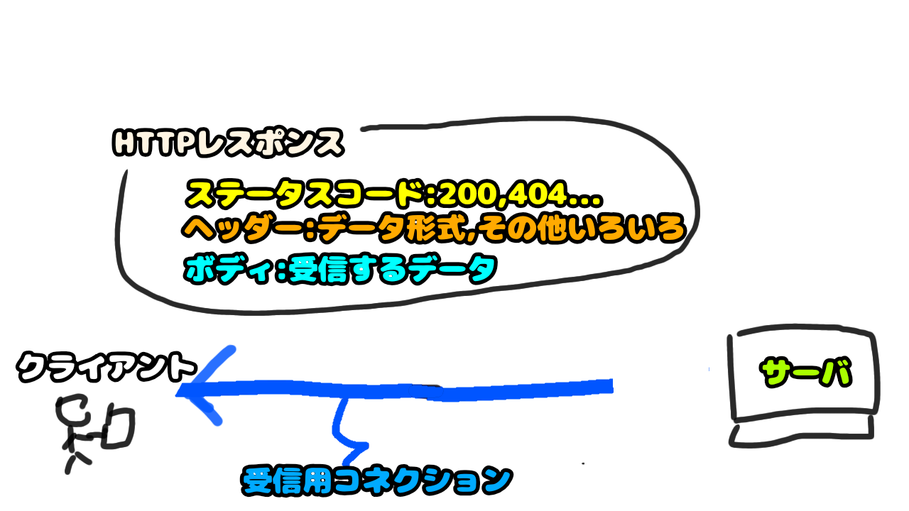

# 5. [サーバが応答を返却する](5.md)
- サーバはRequestに対する応答と Webページの本体を返却します
- HttpRequestに対する処理結果をステータスコードと呼びます
    - 正常は200や201、異常は404や401，403などです。404はよく見る人もいるのではないでしょうか。

サーバは指示された内容を元にTCPコネクション経由で応答（処理結果とhtmlデータ）を返却します

# 補足: ステータスコード、リファラ

## ステータスコード
### 20x
### 30x
### 40x
### 50x
## リファラ

# 検索用関連キーワード
ステータスコード
# 参考リンク