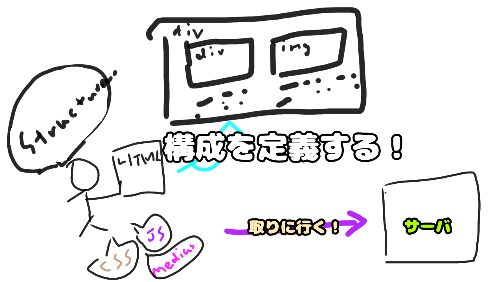

# 7. [HTMLを読み込む](7.md)
- HTMLに含まれているテキストやボタン、画像などを表示する
- HTMLは<a>や<li>、<table>などタグで表現されているので、それらをリンクや表などに変換していきます。

HTMLを解釈して表示用のオブジェクトを生成します。このオブジェクトのことをDOMと呼びます

# 補足: HTML
## タグ
## DOM

# 検索用関連キーワード
# 参考リンク