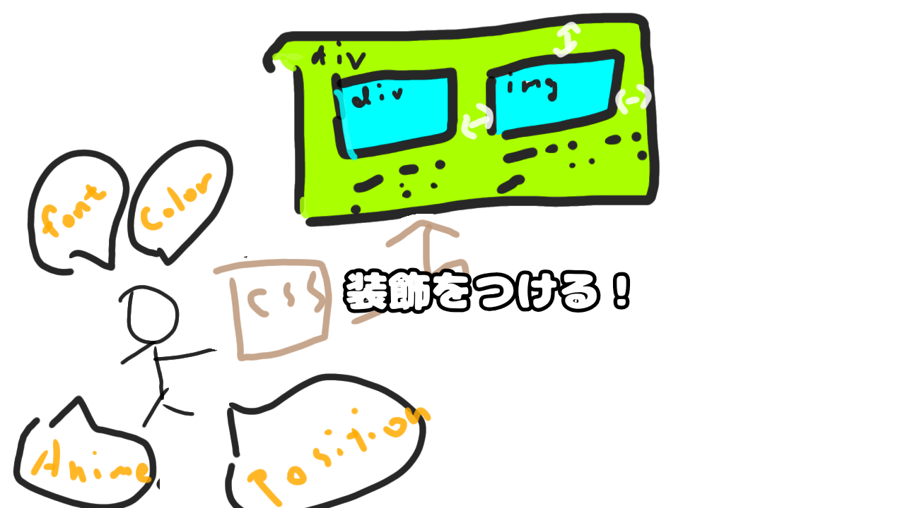

# 8. [CSSを適用する](8.md)
- 7で生成した表示用のオブジェクトにスタイルを適用します。
- スタイルは要素の幅や高さ、文字列の色や背景色など表示に関連する一連の情報を指します
    - CSSだけでアニメーションしたりボタンを豪華にしたり色んな事ができます。

HTML要素にスタイル情報を適用します。

# 補足: セレクタ
## セレクタ

# 検索用関連キーワード
# 参考リンク