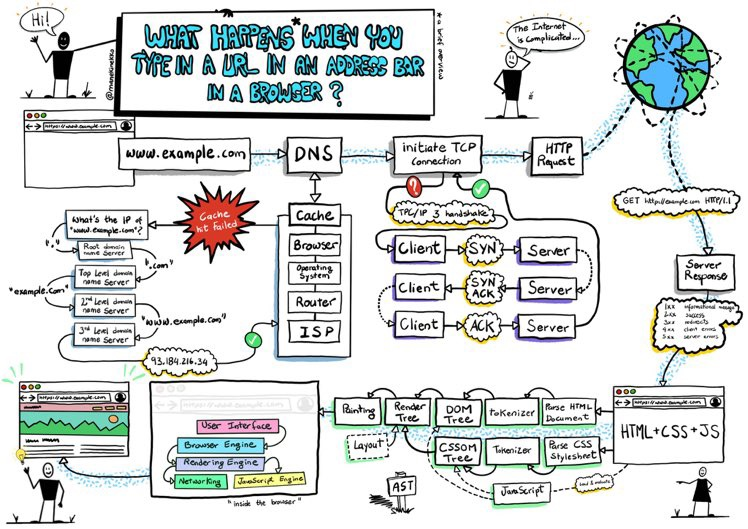
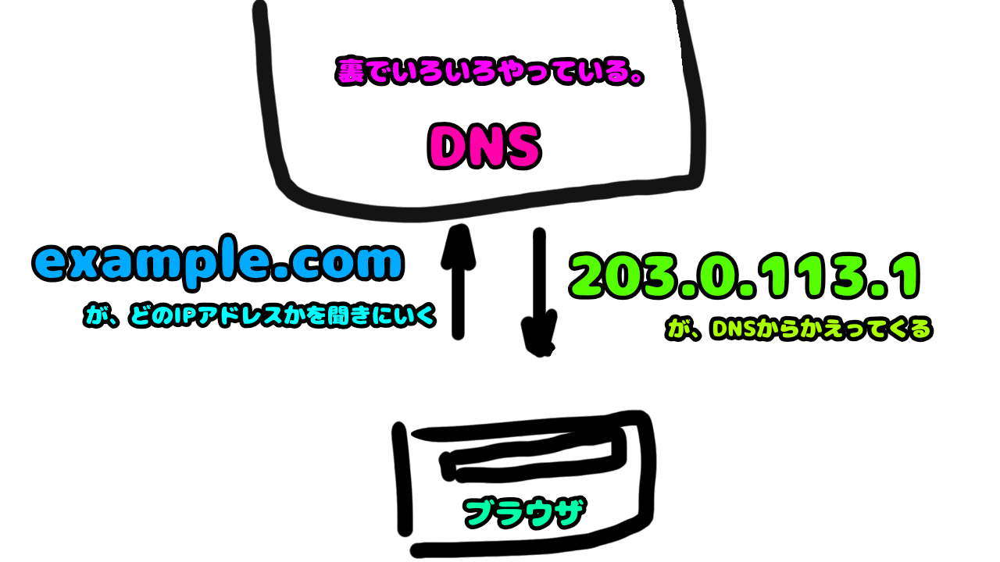
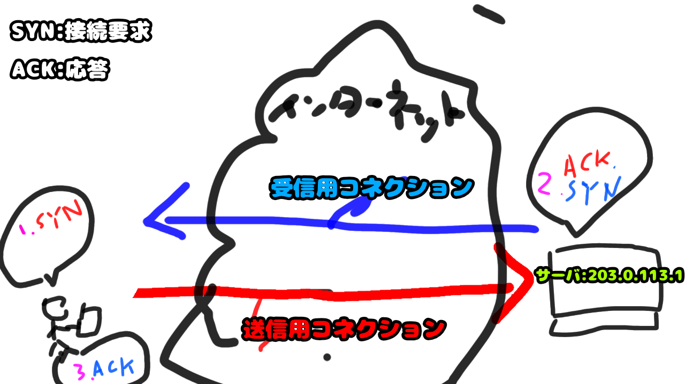

# ブラウザでWebページが表示されるまでを追いかけてみよう

上記はブラウザがWebページを表示するまでに行われていることをまとめた図です。 
このブロックでは、上の画像でやってることをなんとなく説明できるようになることを目標としています。 
各章、補足を詳細ページ内に記載しています。興味があるところは章題をクリックして読んでみてください

# 1. [ブラウザのアドレスバーにURLを入れる](1.md)
- リンクをクリックしたときや、googleで検索を行ったとき、ブラウザのアドレスバーにURLが入力されます。
- ブラウザはURLが入力されると、URLで指定されたサーバにアクセスし、情報を取得しようとします。
- 細かいことは補足を読むんだ。

まずは、入力されたURLを読み解いて、どういう方法で（=スキーム）、どこに接続して(=host)、何を要求するか（=url-path)を決定します

# 2. [URLををもとに接続したい相手を探す](2.md)
- URLを解読した結果のホスト名から接続先を探します。
- DNSにこのホスト名のIPアドレスを教えてください、と問い合わせするとDNSがIPアドレスを教えてくれます。

接続先のhost(=ドメイン)がどこにあるのか(IPアドレス)をDNSに問い合わせ、接続先のIPアドレスを取得します

# 3. [クライアントとサーバの接続を確立する](3.md)
- 取得したIPアドレスに対して接続を試みるよ！
- IPアドレスに対してTCPコネクションを確立します

接続先のIPアドレスとブラウザ（接続元）の間にTCPコネクション（通信経路）を確立します

# 4. [クライアントの要求をサーバに伝える](4.md)
- 接続した経路を利用してクライアントの要求をサーバに伝えます。
- http、httpsだとGETやPOSTなどのメソッドがあるよ！
- ブラウザにURL入れたときに動くメソッドはGETです。

TCPコネクションを利用して、Webページの取得要求をサーバに伝えます

# 5. [サーバが応答を返却する](5.md)
- サーバはRequestに対する応答と Webページの本体を返却します
- HttpRequestに対する処理結果をステータスコードと呼びます
    - 正常は200や201、異常は404や401，403などです。404はよく見る人もいるのではないでしょうか。

サーバは指示された内容を元にTCPコネクション経由で応答（処理結果とhtmlデータ）を返却します

# 6. [受け取った応答をブラウザが解釈する](6.md)
- htmlを解釈します
- html中に画像やcss等別のリソースがあるのであれば 1〜5までの処理を実施してデータの取得を行います。

htmlを解読して必要なデータを取得したりするよ！ 
htmlは上から順番に読み込まれるので、7−9の手順は記載順やjsなどの記述で順番が前後します。

# 7. [HTMLを読み込む](7.md)
- HTMLに含まれているテキストやボタン、画像などを表示する
- HTMLは<a>や<li>、<table>などタグで表現されているので、それらをリンクや表などに変換していきます。

HTMLを解釈して表示用のオブジェクトを生成します。このオブジェクトのことをDOMと呼びます

# 8. [CSSを適用する](8.md)
- 7で生成した表示用のオブジェクトにスタイルを適用します。
- スタイルは要素の幅や高さ、文字列の色や背景色など表示に関連する一連の情報を指します
    - CSSだけでアニメーションしたりボタンを豪華にしたり色んな事ができます。

HTML要素にスタイル情報を適用します。

# 9. [JSの処理を実施する](9.md)
- JavaScriptによる処理を実行します
- JavaScriptからDOMを変更したり、APIなどを経由してユーザー個別の情報を取得して表示したり等、”動的”な処理を提供できます。

javascriptの処理を実施します。最終的にはDOMを変更してユーザーに見える状態にします

# 10. [画面が表示される！](10.md)
- 複数のページを組み合わせてサービスを提供したり、1枚のWebページをベースにサービスを提供したり色んなやり方でサービスが提供されます

html，js，cssの3点セットが連携してwebページが表示されます